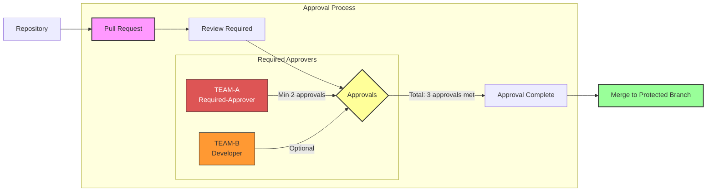
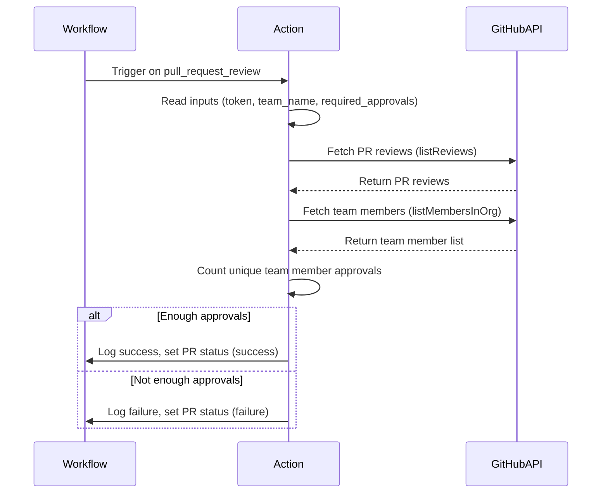

# GitHub Action Team Approval

This GitHub Action checks if a specified number of reviewers from a designated team have approved a pull request. It triggers on pull request review events and utilizes GitHub checks to declare the action as "success" or "failed" based on the conditions.

> **Note:**  
> This action is designed to work in conjunction with [GitHub branch protection rules](https://docs.github.com/en/enterprise-cloud@latest/repositories/configuring-branches-and-merges-in-your-repository/managing-protected-branches/managing-a-branch-protection-rule) that require pull requests and enforce that "all required status checks pass" before merging.  
> Make sure your protected branch has these rules enabled for this action to enforce team approvals effectively.

## Key Features

- Triggers on pull request reviews.
- Checks if reviewers are part of a specified team.
- Verifies if the required number of approvals from that team has been met.
- Declares the action as `"success"` or `"failed"` based on the approval conditions.

## Getting Started

### Setup instructions

1. **Setup the Action**: Create a workflow file in your repository under `.github/workflows/team-approval.yml`.

2. **Configure the Action**: Use the following example to configure the action in your workflow:

   ```yaml
   name: Team Approval Check

   on:
     pull_request_review:
       types: [submitted]
       
   permissions:
     contents: read
     pull-requests: read
     issues: read
   
   jobs:
     approval-check:
       runs-on: ubuntu-latest
       steps:
         - name: Check Team Approvals
           uses: jefeish/github-action-team-approval@main
           with:
             team_name: a-team
             required_approvals: 2
             token: ${{ secrets.GH_ADMIN_SECRET }}

   ```

### Inputs

| Name                | Description                                               | Required |
|---------------------|-----------------------------------------------------------|----------|
| `team_name`         | The name of the team whose approvals are required.         | Yes      |
| `required_approvals`| The minimum number of approvals needed from the team.      | Yes      |
| `token`             | GitHub token with access to read PRs and team membership.  | Yes      |

## Prerequisites

- Ensure that the GitHub Action has the necessary permissions to read pull request reviews and team memberships.
- The action should be placed in a repository that has the specified team configured in GitHub.
- **Branch protection rules are required:**  
  This action only enforces approvals if your branch protection rules require pull requests and specify that "all required status checks must pass" before merging.  
  Make sure to enable these rules on your protected branches for this action to have effect.

---

## How it Works!

### Approval Logic

This diagram illustrates the approval process enforced by the action: 
- a pull request requires a minimum number of approvals from a specific team before it can be merged into a protected branch.



---

### Workflow Sequence Diagram



---

## License

This project is licensed under the MIT License. See the LICENSE file for more details.
